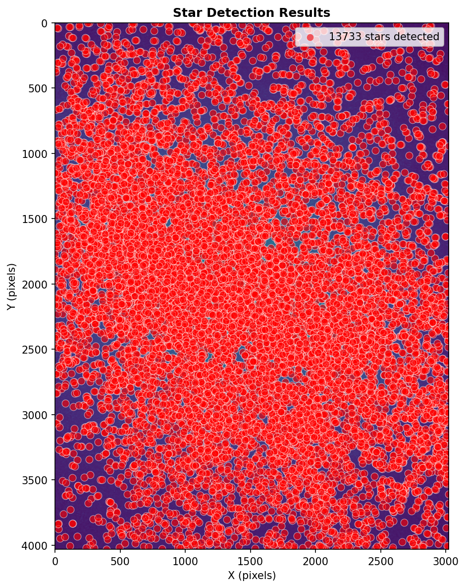

# Summary

Amanogawa is an open-source, MIT-licensed Python package and reproducible workflow for extracting quantitative summaries from a single wide-field smartphone Milky Way image. The current release is built around a limitation-aware single-image contract: it turns one still image into inspectable artifacts that support relative structure analysis while preserving explicit interpretation boundaries.

From a single image, Amanogawa detects candidate point sources, exports coordinate catalogs, and computes spatial statistics that summarize stellar clustering across scales. In parallel, it estimates the principal axis of the Milky Way band in image coordinates, measures band width from perpendicular profiles, and characterizes dark-lane morphology. The full pipeline also produces a visibility v1 artifact pair (`visibility_features.json` and `visibility_score.json`) that summarizes how much relative Milky Way visibility and analyzable evidence is present in the submitted image. This visibility score is explicitly observation-based: it does not estimate absolute sky quality or absolute light pollution, and low scores may reflect device limitations, processing, or capture quality rather than the observing site alone.

The workflow supports both interactive notebook use and a command-line interface, producing archival-friendly artifacts including star catalogs, threshold-sweep summaries, fitted band-width parameters, diagnostic figures, run manifests, and visibility summaries (CSV/JSON/PNG, with optional FITS export). Input scope is intentionally simple: one still image in a common format readable by Pillow, including JPEG, PNG, and TIFF, with optional HEIF/HEIC support through an extra dependency. By combining explicit robustness diagnostics with a standardized end-to-end artifact model, Amanogawa provides a software foundation for later astronomy-methods validation and future citizen-science submission tools.

# Statement of need

Consumer astrophotography and citizen-science observations have become widespread, yet the scientific potential of smartphone-collected wide-field Milky Way images remains largely untapped. Common tools for smartphone and hobbyist images primarily target aesthetic outputs (stacking, denoising, stretching) rather than transparent measurement and robustness diagnostics, creating a barrier to quantitative citizen participation in astronomical observation and discovery. Conversely, quantitative studies of Galactic structure and stellar clustering often rely on curated survey catalogs and pipelines that assume calibrated instruments and rich metadata. This creates a practical gap: single-exposure images are easy to collect and share, yet difficult to convert into defensible, reproducible summaries with clearly stated limits.

The target audience includes: (1) researchers prototyping quantitative analyses from consumer wide-field imagery, (2) educators and citizen-science organizers who need limitation-aware, reproducible outputs, and (3) reviewers who need inspectable software artifacts rather than presentation-oriented image processing results.

# State of the field

Existing astronomical software such as SExtractor [@bertin1996] and astrometry.net [@lang2010astrometrynet] excel at source detection and astrometric calibration for calibrated telescope data, but are not optimized for the specific workflow of single smartphone exposures without prior astrometry. Photometric and morphological analysis tools like Astropy and Photutils [@astropy2022; @photutils1110] provide excellent building blocks but require significant configuration and do not by themselves define a submission-ready contract for smartphone imagery. Amanogawa packages these building blocks into a reproducible artifact pipeline with per-image normalization, threshold-sweep diagnostics, morphology summaries, and an explicit separation between image-based evidence quality and stronger downstream interpretation.

Amanogawa was developed as a new package rather than as a thin extension to one existing tool because the main contribution is the integrated contract across multiple analysis layers (detection, spatial statistics, band geometry, dark morphology, and visibility scoring), together with standardized provenance artifacts (`run_manifest.json`, JSON/CSV summaries, and diagnostic figures) that remain consistent across notebook and CLI workflows.

# Software design

Amanogawa addresses this gap by providing an end-to-end pipeline that connects (1) source detection, (2) spatial statistics, (3) Milky Way band geometry, (4) dark-lane morphology, and (5) a visibility v1 scoring layer into a coherent and inspectable workflow. For source detection, Amanogawa uses Laplacian-of-Gaussian (LoG) blob detection [@lindeberg1998] (implemented via standard scientific Python image-processing tooling [@vanderwalt2014scikitimage]) and includes an explicit *threshold-sweep* routine that recomputes downstream metrics across a range of detection thresholds. This built-in sensitivity analysis helps users avoid over-interpreting results tied to a single parameter choice and provides a simple, teachable robustness layer for non-specialists.

For clustering analysis, Amanogawa computes the two-point correlation function $\xi(r)$ with a DD/RR$_\mathrm{expected}$ - 1 estimator, where RR$_\mathrm{expected}$ is the analytic Poisson pair expectation for annuli in a rectangular image window [@peebleshauser1974; @peebles1980], alongside nearest-neighbour distance distributions [@clark1954]. For large catalogs, point subsampling is performed with a fixed random seed to preserve reproducibility. The software also includes box-count scaling as a compact descriptive summary of multi-scale occupancy rather than as a formal estimator of fractal dimension, complementing $\xi(r)$ by providing an intuitive, coarse-grained view of spatial structure. Optional magnitude-stratified clustering is supported by pairing simple aperture photometry with quantile binning, allowing users to compare $\xi(r)$ across brightness groups without leaving the workflow [@photutils1110; @astropy2022].

For Milky Way band morphology, Amanogawa estimates the band principal axis from the second-order moments of the source-density distribution, equivalent to a PCA on the density field [@pedregosa2011sklearn]. This choice provides a simple, rotation-invariant summary of the dominant elongation of the Milky Way band and avoids subjective, image-edge–based axis selection. The software then measures the perpendicular band width by fitting smooth profile families (Gaussian and Lorentzian), capturing both core width and heavy-tail behaviour. These outputs are primarily interpreted in pixel units for internal and relative analyses; if external plate-scale information is available, users can convert widths into angular units downstream [@astropy2022; @lang2010astrometrynet].

The current release also includes a visibility v1 layer that combines point-source, diffuse-structure, and background-related features into an image-based relative visibility / analyzability score. Crucially, this score is not a calibrated measure of true sky quality; it is a structured summary of what the submitted image supports. Device metadata are preserved for later calibration-aware analysis, but device-adjusted comparability is intentionally out of scope for this release.

The workflow can be run on a single 30 s smartphone exposure to produce stable, inspectable outputs across threshold sweeps, together with run manifests and visibility artifacts that preserve provenance and interpretation boundaries. The software’s main contribution is therefore not a claim of definitive astrophysical inference from one image, but a reproducible measurement framework: it defines what can be extracted from one smartphone image today, what remains only a relative proxy, and which stronger claims must wait for later calibration and methods validation. In this sense, Amanogawa answers a software need that is central to the broader project mission: it makes "one smartphone photo" a traceable scientific input before broader methods claims or public citizen-science deployment are attempted.

# Research impact statement

Amanogawa currently contributes near-term scholarly significance through reproducible research materials that can be independently re-run and inspected by reviewers and downstream users. The repository provides deterministic test coverage, continuous integration checks, documented reviewer verification commands, and a single-command end-to-end pipeline that emits provenance-preserving artifacts (including per-image run manifests and visibility summaries). This enables objective software review and reproducible comparison across parameter settings before stronger calibration-dependent scientific claims are attempted.

In practical terms, the package is designed to be reused as a common preprocessing and measurement layer for follow-on astronomy-methods validation work, classroom/research training workflows, and future community submission pipelines where transparent limitation handling is required alongside quantitative outputs.

# Example Output

The figure illustrates a representative diagnostic visualization generated by the pipeline. It is included to demonstrate the type of artifact the software produces, not to support a scientific claim.

This visualization is automatically generated using the `--plot-output` flag in the `amanogawa-detect` CLI tool, providing immediate visual feedback on detection quality and quick assessment of detection parameters.

# Acknowledgements

Amanogawa is built on the scientific Python ecosystem. The author thanks the maintainers and contributors of the open-source libraries that make this work possible, including NumPy [@harris2020numpy], SciPy [@virtanen2020scipy], scikit-image [@vanderwalt2014scikitimage], Astropy and Photutils [@astropy2022; @photutils1110], and the broader data/visualization stack used to produce the exported artifacts and figures.

The software is archived on Zenodo under DOI [10.5281/zenodo.18213564](https://doi.org/10.5281/zenodo.18213564).

The author welcomes and anticipates future contributions from citizen astronomers and community members who wish to share smartphone observations and join in collaborative analysis of wide-field Milky Way structure.

# AI usage disclosure

The following generative AI tools were used in the development and documentation of this work:

- **Tools/Models**: ChatGPT 5.2 Thinking, GitHub Copilot (Claude Haiku 4.5)
- **Where**: Code (e.g., function implementations, test generation), documentation (e.g., README, docstrings), and paper (e.g., phrasing, grammar review)
- **Nature of assistance**: Code generation, refactoring, documentation writing, proofreading, and test generation
- **Human review**: All AI-generated content was reviewed, validated, and verified by the author; final judgments on scientific claims, methodology, and correctness remain the author's responsibility

# References
